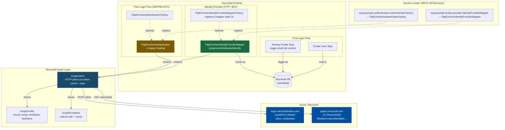
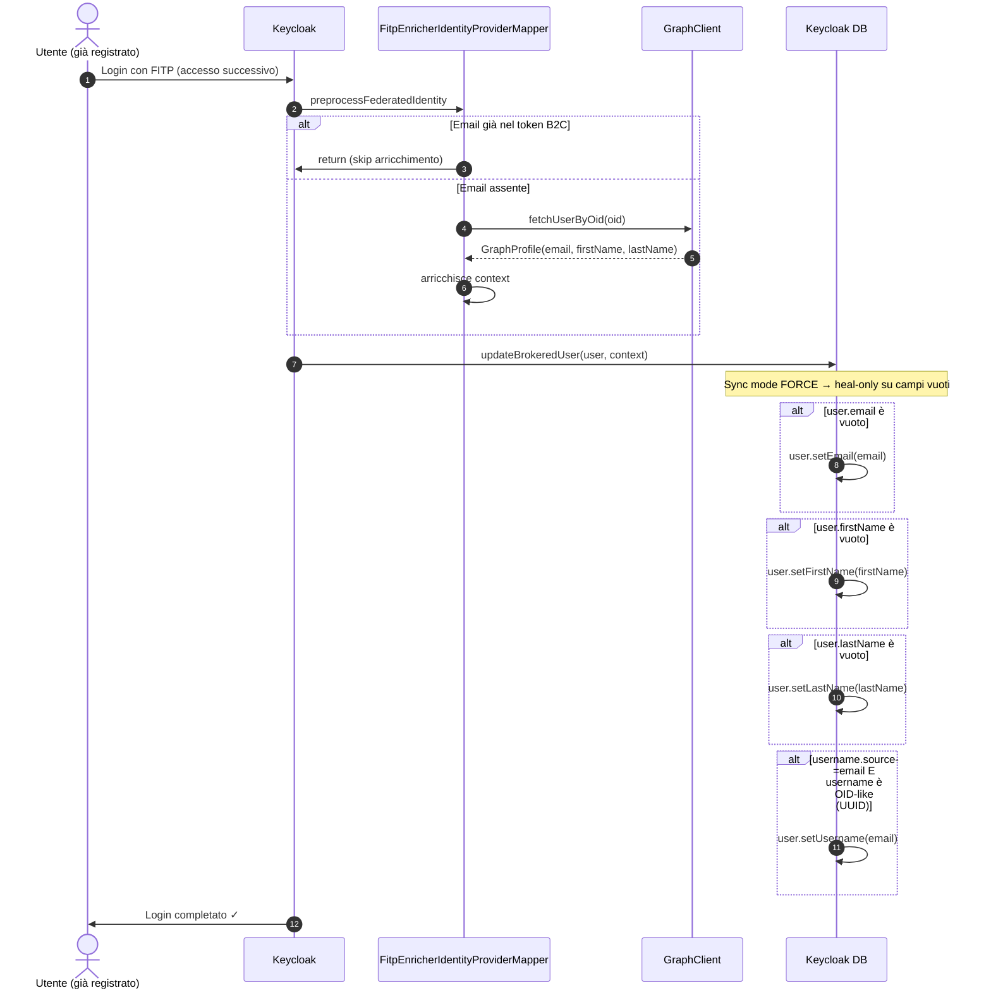
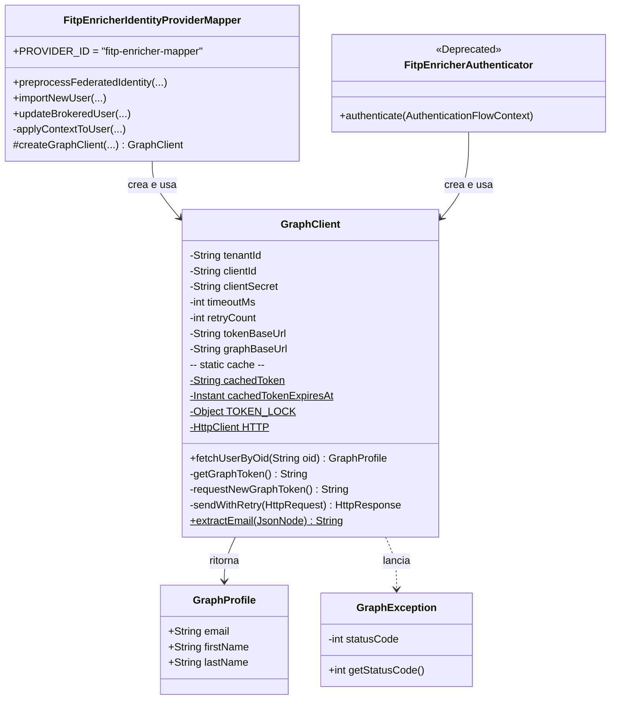

# Architettura — FITP Profile Enricher

Documentazione tecnica dettagliata del plugin Keycloak `fitp-enricher`.

---

## 1. Panoramica

Il plugin risolve un problema specifico del login federato con **Azure AD B2C (FITP)**: B2C non include l'email nel JWT restituito all'IdP Keycloak. Di conseguenza, il First Login Flow di Keycloak fallisce con `KC-SERVICES0020: Email is null` prima ancora di poter creare l'utente.

La soluzione è un **Identity Provider Mapper** (`FitpEnricherIdentityProviderMapper`) che viene invocato in `preprocessFederatedIdentity` — prima di qualsiasi step del First Login Flow — e chiama **Microsoft Graph** per recuperare il profilo utente (email, nome, cognome) usando le credenziali dell'app registration (client credentials flow).

---

## 2. Componenti

```
com.hiwaymedia.keycloak
├── FitpEnricherIdentityProviderMapper       ← componente principale (v1.1+)
├── FitpEnricherIdentityProviderMapperFactory← registrazione SPI mapper
├── FitpEnricherAuthenticator                ← DEPRECATO (v1.0 legacy, mantenuto per healing)
├── FitpEnricherAuthenticatorFactory         ← DEPRECATO
└── graph/
    ├── GraphClient                          ← client HTTP verso Microsoft Graph
    ├── GraphProfile                         ← record dati profilo (email, firstName, lastName)
    └── GraphException                       ← eccezione con HTTP status code
```

| Componente | Tipo SPI Keycloak | Hook di esecuzione |
|---|---|---|
| `FitpEnricherIdentityProviderMapper` | `IdentityProviderMapper` | `preprocessFederatedIdentity` |
| `FitpEnricherAuthenticator` *(depr.)* | `Authenticator` | Post Login Flow |

---

## 3. Diagramma dei componenti



---

## 4. Flusso di login — sequenza dettagliata

```mermaid
sequenceDiagram
    autonumber
    actor U as Utente
    participant App as Applicazione Client
    participant KC as Keycloak
    participant Mapper as FitpEnricherIdentityProviderMapper
    participant GC as GraphClient
    participant AAD as Azure AD / Token endpoint
    participant GME as Microsoft Graph API
    participant DB as Keycloak DB

    U->>App: Clicca "Accedi con FITP"
    App->>KC: Redirect to /auth (OIDC Authorization Code)
    KC->>U: Redirect to Azure AD B2C login page

    U->>AAD: Inserisce credenziali B2C
    AAD->>KC: Callback con authorization_code (JWT senza email)
    
    Note over KC,Mapper: preprocessFederatedIdentity — PRIMA del First Login Flow

    KC->>Mapper: preprocessFederatedIdentity(BrokeredIdentityContext)
    
    alt Email già presente nel context (token B2C la include)
        Mapper->>KC: return (skip)
    else Email assente o context non ancora arricchito
        Mapper->>GC: fetchUserByOid(oid)
        
        alt Token cache valido (< expires_at - 60s)
            GC->>GC: usa cachedToken
        else Token scaduto o assente
            GC->>AAD: POST /oauth2/v2.0/token (client_credentials)
            AAD-->>GC: access_token + expires_in
            GC->>GC: cachedToken = token; cachedTokenExpiresAt = now + expires_in - 60s
        end

        GC->>GME: GET /v1.0/users/{oid}?$select=mail,otherMails,givenName,surname,...
        
        alt HTTP 200
            GME-->>GC: JSON profilo utente
            GC->>GC: extractEmail(data) → mail / otherMails[0] / identities[emailAddress]
            GC-->>Mapper: GraphProfile(email, firstName, lastName)
            Mapper->>Mapper: context.setEmail(email)<br/>context.setFirstName(firstName)<br/>context.setLastName(lastName)
            
            opt username.source = email
                Mapper->>Mapper: context.setModelUsername(email)
            end
            
            Mapper->>Mapper: contextData.put("fitp-enricher.done", true)
        else HTTP 429 / 503 e retry disponibili
            GC->>GC: sleep 250ms → retry
            GC->>GME: retry GET
        else HTTP 4xx/5xx non recuperabile
            GC-->>Mapper: GraphException(statusCode)
            
            alt failOnError = true
                Mapper->>KC: throw IdentityBrokerException
                KC->>U: Pagina di errore login
            else failOnError = false (default)
                Mapper->>KC: return (context parzialmente vuoto)
            end
        end
    end

    Note over KC,DB: First Login Flow — context già arricchito

    KC->>KC: IdpReviewProfileAuthenticator<br/>(legge email dal context ✓)
    KC->>DB: importNewUser(user, context)
    DB->>DB: user.setEmail(email)<br/>user.setFirstName(firstName)<br/>user.setLastName(lastName)<br/>user.setEmailVerified(trustEmail)
    
    KC->>App: Authorization Code (o token) — login completato
    App->>U: Accesso concesso ✓
```

---

## 5. Flusso login successivi (utente già esistente)



---

## 6. GraphClient — logica interna

```mermaid
flowchart TD
    A([fetchUserByOid chiamato]) --> B{Token in cache\ne non scaduto?}
    B -- Sì --> D[Usa cachedToken]
    B -- No --> C[/Acquisisce TOKEN_LOCK/]
    C --> C2{Double-check\ncache nel lock}
    C2 -- Cache valida --> D
    C2 -- Cache invalida --> E[POST /oauth2/v2.0/token<br/>client_credentials]
    E --> F{HTTP 200?}
    F -- No --> G[throw GraphException\nstatusCode=HTTP status]
    F -- Sì --> H[Salva cachedToken<br/>cachedTokenExpiresAt = now + expires_in - 60s]
    H --> D

    D --> I[GET /v1.0/users/{oid}\n?$select=mail,otherMails,givenName,surname,\nidentities,userPrincipalName]
    I --> J{HTTP status}
    J -- 200 --> K[Parsa JSON]
    J -- 429 o 503 --> L{attempts ≤ retryCount?}
    L -- Sì --> M[sleep 250ms → retry]
    M --> I
    L -- No --> N[throw GraphException\nstatusCode=429/503]
    J -- Timeout --> O{attempts ≤ retryCount?}
    O -- Sì --> M
    O -- No --> P[throw GraphException\nstatusCode=0]
    J -- 401/403/404 --> N2[throw GraphException\nno retry]

    K --> Q[extractEmail:\n1. data.mail\n2. otherMails[0]\n3. identities[signInType=emailAddress]]
    Q --> R([return GraphProfile\nemail, firstName, lastName])

    style A fill:#1a6b3c,color:#fff
    style R fill:#1a6b3c,color:#fff
    style G fill:#7a1a1a,color:#fff
    style N fill:#7a1a1a,color:#fff
    style N2 fill:#7a1a1a,color:#fff
    style P fill:#7a1a1a,color:#fff
```

---

## 7. Estrazione email da Microsoft Graph

B2C e Entra ID espongono l'email in campi diversi a seconda del tipo di account. `GraphClient.extractEmail()` segue questa priorità:

```
1. data.mail                         → utenti Entra ID standard (es. account aziendali)
2. data.otherMails[0]               → local accounts B2C (caso più comune per FITP)
3. identities[].issuerAssignedId    → dove signInType = "emailAddress"
                                       (fallback per B2C con policy personalizzate)
```

Se nessuno dei tre è presente, `extractEmail` ritorna `null` (nessun enrichment email).

---

## 8. Modello dati



---

## 9. Parametri di configurazione

Tutti i parametri si configurano sulla UI Keycloak (Admin Console → Identity Providers → FITP → Mappers → FITP Profile Enricher Mapper).

| Parametro | Tipo | Default | Descrizione |
|---|---|---|---|
| `graph.tenantId` | String | — | Tenant ID o domain Azure/B2C. **Obbligatorio.** |
| `graph.clientId` | String | — | Application (client) ID dell'app registration. **Obbligatorio.** |
| `graph.clientSecret` | Password | — | Client secret dell'app registration. **Obbligatorio.** |
| `graph.timeoutMs` | Integer | `8000` | Timeout HTTP in millisecondi per token endpoint e Graph API. |
| `graph.retryCount` | Integer | `1` | Numero di retry su timeout, HTTP 429 e HTTP 503. Backoff fisso 250ms. |
| `graph.failOnError` | Boolean | `false` | Se `true`, blocca il login in caso di errore Graph. Se `false`, il login procede con profilo parziale. |
| `graph.trustEmail` | Boolean | `true` | Se `true`, marca l'email recuperata da Graph come verificata (`emailVerified = true`). |
| `username.source` | Enum | `email` | `email`: username Keycloak = email da Graph. `oid`: username = OID/sub B2C (comportamento legacy). |

---

## 10. Registrazione SPI (Service Loader)

Il plugin usa il meccanismo standard Java SPI tramite due file in `META-INF/services/`:

```
META-INF/services/org.keycloak.broker.provider.IdentityProviderMapper
  → com.hiwaymedia.keycloak.FitpEnricherIdentityProviderMapper

META-INF/services/org.keycloak.authentication.AuthenticatorFactory
  → com.hiwaymedia.keycloak.FitpEnricherAuthenticatorFactory  (DEPRECATO)
```

Keycloak carica automaticamente queste classi all'avvio tramite `java.util.ServiceLoader` dopo aver eseguito `kc.sh build`.

---

## 11. Nota sull'Authenticator legacy (DEPRECATO)

`FitpEnricherAuthenticator` (v1.0) girava come step nel **Post Login Flow**, ovvero DOPO il First Login Flow. Il problema è che il First Login Flow aveva già bisogno dell'email per creare l'utente — generando `KC-SERVICES0020: Email is null` al primo accesso di ogni nuovo utente.

Il mapper `FitpEnricherIdentityProviderMapper` (v1.1+) risolve questo girando in `preprocessFederatedIdentity`, **prima** di qualsiasi step del First Login Flow.

Il vecchio authenticator rimane nel jar per:
1. **Compatibilità binaria**: installazioni esistenti non si rompono all'upgrade del jar.
2. **Healing utenti legacy**: può essere usato per popolare i campi vuoti degli utenti già creati con record incompleto.

Sarà rimosso in **v2.0.0**.
