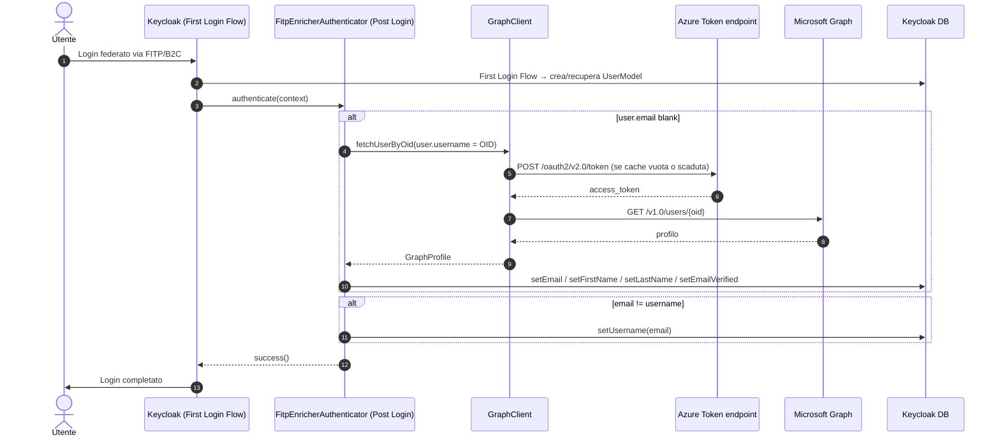

# Architettura — FITP Profile Enricher

Documentazione tecnica del plugin Keycloak `fitp-enricher`.

---

## 1. Panoramica

Il plugin gira come step `Authenticator` in un **Post Login Flow** agganciato all'IdP FITP/B2C. A ogni login federato:

1. Se l'utente Keycloak non ha email, chiama **Microsoft Graph** (client credentials) per recuperare email/firstName/lastName e li popola.
2. Se l'email è valorizzata e diversa dallo `username` corrente, riallinea `username = email`.

Questo guarisce automaticamente gli utenti pre-esistenti con `username = OID/UUID` di B2C: al loro primo login successivo allo upgrade lo username viene riscritto.

---

## 2. Componenti

```
com.hiwaymedia.keycloak
├── FitpEnricherAuthenticator           ← step Post Login Flow
├── FitpEnricherAuthenticatorFactory    ← registrazione SPI + UI config
└── graph/
    ├── GraphClient                     ← HTTP client Microsoft Graph
    ├── GraphProfile                    ← record (email, firstName, lastName)
    └── GraphException                  ← eccezione con HTTP status code
```

| Componente | Tipo SPI Keycloak | Hook |
|---|---|---|
| `FitpEnricherAuthenticator` | `Authenticator` | Post Login Flow |

---

## 3. Sequenza di login



---

## 4. GraphClient — logica interna

Token Graph cachato in memoria (~1h, condiviso a livello statico). Retry breve su timeout / 429 / 503 con backoff fisso 250ms, fino a `retryCount` tentativi. Mai retry su 401/403/404.

Estrazione email priorità:
1. `data.mail` (Entra ID)
2. `data.otherMails[0]` (B2C local accounts — caso più comune FITP)
3. `data.identities[].issuerAssignedId` con `signInType = "emailAddress"`

---

## 5. Parametri di configurazione

Tutti sulla UI Keycloak (Authentication > Flows > step `FITP Profile Enricher`).

| Parametro | Tipo | Default | Descrizione |
|---|---|---|---|
| `graph.tenantId` | String | — | Tenant ID o domain Azure/B2C. Obbligatorio. |
| `graph.clientId` | String | — | Application (client) ID. Obbligatorio. |
| `graph.clientSecret` | Password | — | Client secret. Obbligatorio. |
| `graph.timeoutMs` | Integer | `8000` | Timeout HTTP in ms. |
| `graph.retryCount` | Integer | `1` | Retry su timeout / 429 / 503. |
| `graph.failOnError` | Boolean | `false` | Se `true`, login fallisce su errore Graph. |
| `graph.trustEmail` | Boolean | `true` | Marca email come verificata. |

---

## 6. Registrazione SPI

```
META-INF/services/org.keycloak.authentication.AuthenticatorFactory
  → com.hiwaymedia.keycloak.FitpEnricherAuthenticatorFactory
```

Keycloak carica la classe via `java.util.ServiceLoader` dopo `kc.sh build`.
